# Exercise 4

The purpose of this exercise is to illustrate how we can use CodePipeline to automatically apply changes to our infrastructure whenever a CloudFormation template held in an S3 bucket changes.

There are two stages to this exercise:
* deployment of the S3 bucket and CodePipeline 
* deployment of the infrastructure using CodePipeline

## Deployment of the CodePipeline

Follow the steps below to deploy your pipeline:

1. Log in to AWS console and navigate to CloudFormation page
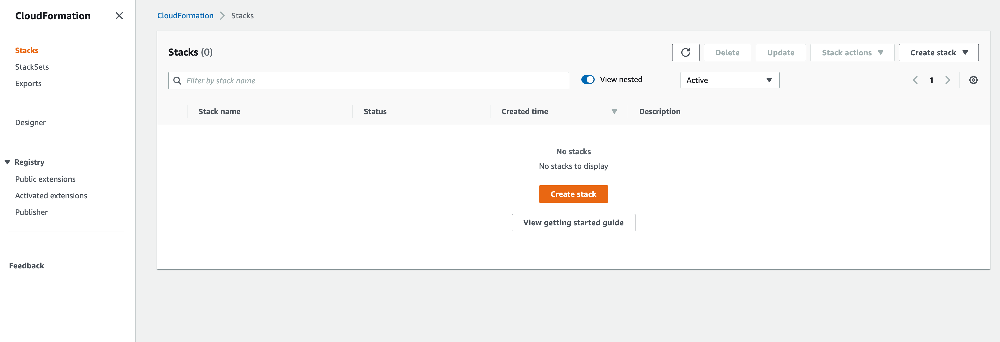
2. Click the "Create Stack" button. You will be taken to the page shown below. Select the "Upload template file" option and upload **cicd.yaml** file from the **Exercise4** directory. Click **Next** when done.
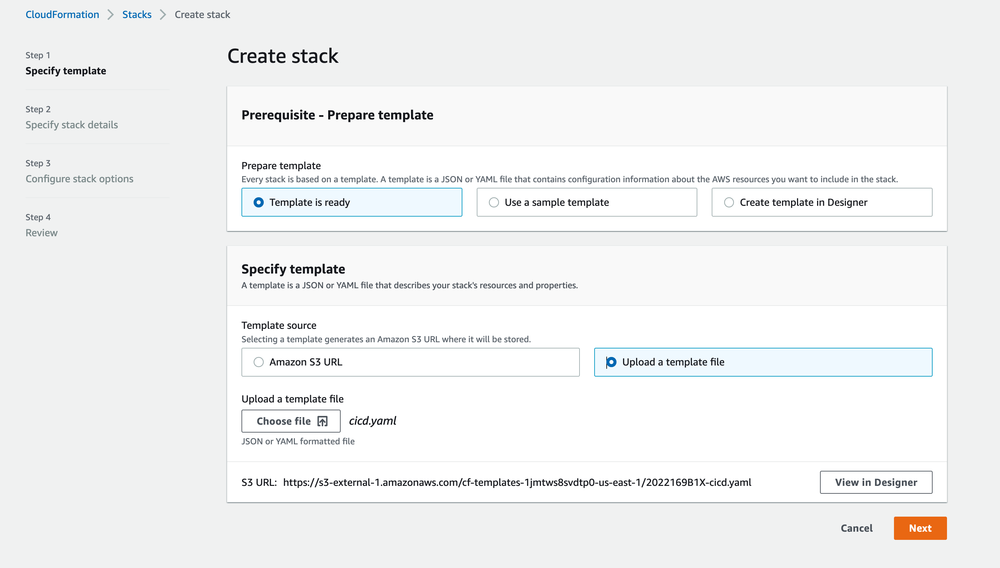
3. Fill in the stack details page as per the image below and click next. 
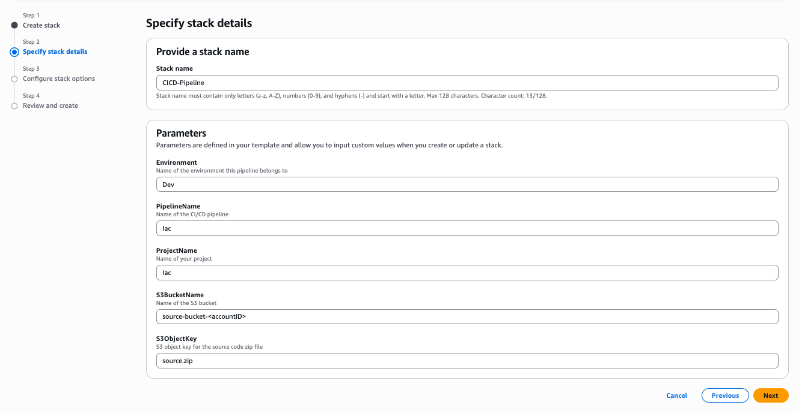
4. Click **next** on the **Configure Stack Options** Page
5. At the bottom of the **Review** page, tick the checkbox to acknowledge that cloud formation may create IaM resources. Finally click the **Create stack** button.
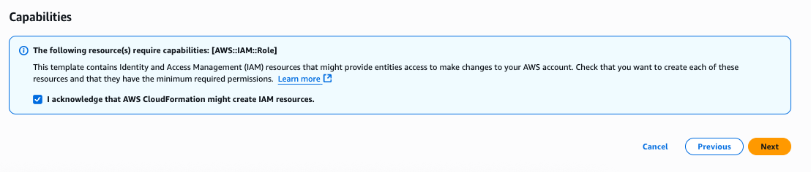
6.  Once the deployment has been initiated, you will be taken to main cloud formation page where you can observe progress of the deployment.
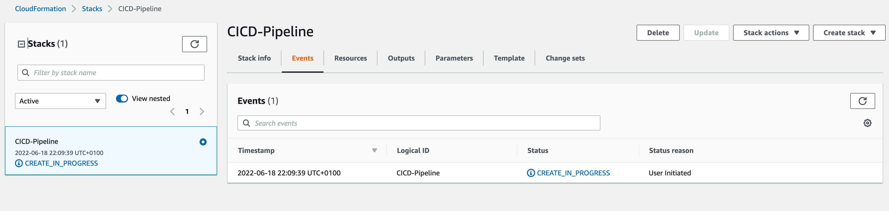
7. Wait for the Stack to get deployed and continue with the next section

## Using CodePipeline

In the previous section we have deployed a stack consisting of an S3 bucket and CodePipeline build pipeline. Now we will illustrate how they work together. The purpose of CodePipeline is to initiate a set of configurable build actions whenever content of an S3 bucket changes. CodePipeline can work with a number of different sources, but in our case we use S3. To see how it works follow the steps below:

1. In the AWS console navigate to CodePipeline. You should see our pipeline in a failed state:
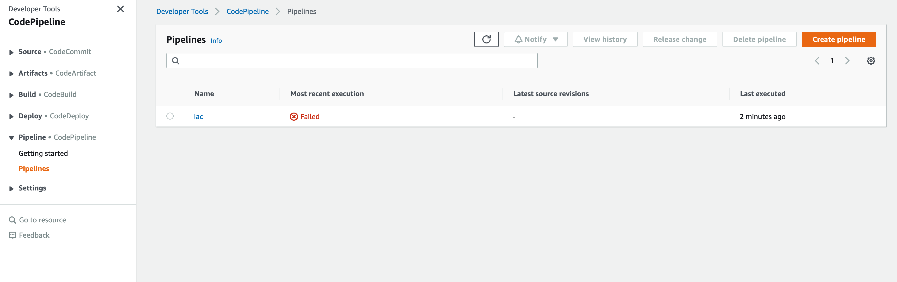
2. Click on the name of the pipeline (Iac) to get to its details screen:
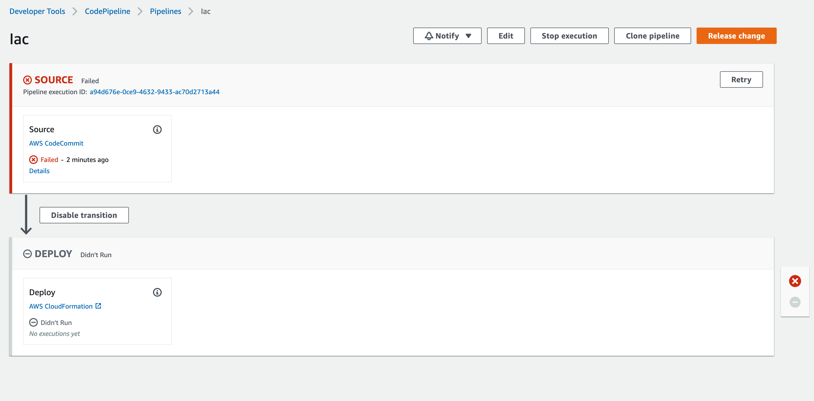
3. As you can see the source stage which downloads the files from S3 bucket has failed. If you click on the details you will get further information. The reason for the failure is simply lack of any files in the bucket.
4. The pipeline expects a zip file named **source.zip** containing **infra.yaml** to be present in the S3 bucket. In order to create it, first navigate to **S3** in the AWS console.
5. Click on your S3 bucket to get to the details screen:
6. As you can see, the bucket is empty. Let's add a file by clicking **Upload** button. Create a zip file containing the **infra.yaml** file from the **Exercise4** directory and upload it as **infra.zip**. CodeDeploy requires the source files to be in a zip format in an S3 bucket because it needs to download and extract these files during the deployment process. This packaging approach ensures all deployment files are bundled together correctly and can be versioned and tracked efficiently.
7. The upload confirmation will be shown:
8. In the AWS console, navigate back to the **CodePipeline** page. You will notice that our  pipeline has started automatically.
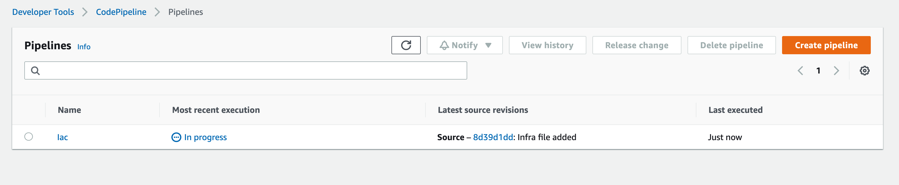
9. Click on the name of the pipeline to get to the details screen. 
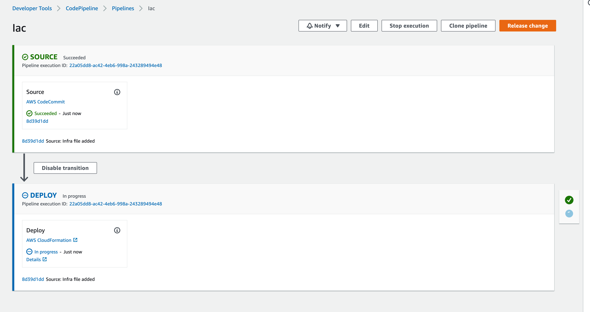
10. Once the pipeline completes, you should see a screen like the one below:
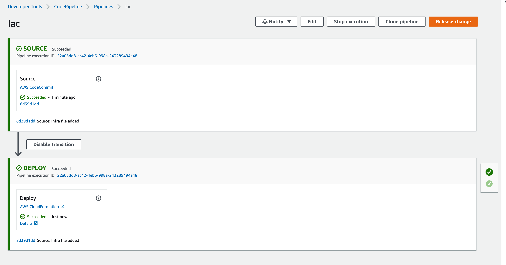
11. Click on the **Details** link of the **Deploy** stage to see the stack that the code pipeline created:
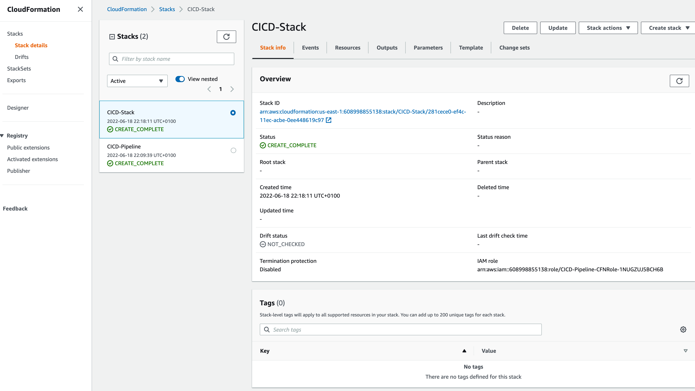

## Next steps
We have seen how uploading a file to the S3 bucket automatically triggers CodePipeline execution which in turn deploys the infrastructure. Feel free to experiment with content of the infra.yaml file by adding tags or other options to the S3 bucket created. Each time you upload a new version of source.zip, the pipeline will run and deploy it modifying the infrastructure to match the cloud formation template.